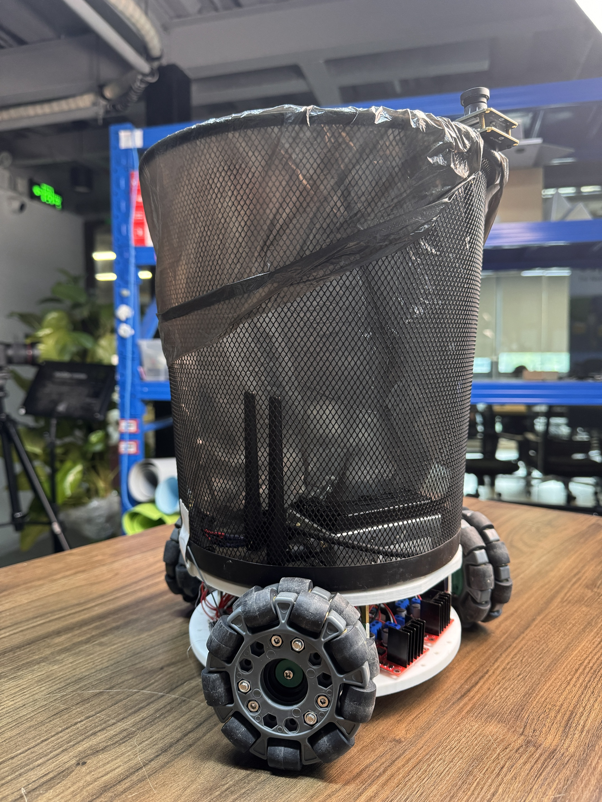

# Lekiwi-Trash-Can

## 👋 Welcome to Lekiwi Trash Can

This project will transform the Lekiwi into a smart trash can.

## TODO
- Improve chassis response speed
- Switch to a more compact motor driver board
- Adding voice interaction with reSpeaker
- Integrating SOArm for ground-level trash pickup

